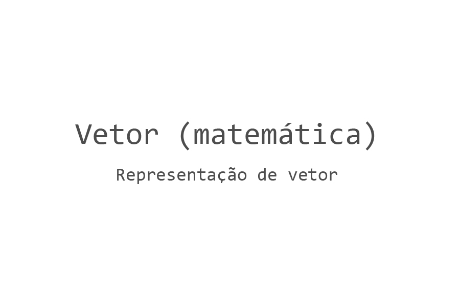

# Matemática para Design Computacional

Math-for-Computational-Design

Estudos de conceitos matemáticos fundamentais para métodos computacionais aplicados a modelagem 3-D e computação gráfica.

Studies of mathematical concepts fundamental to computational design required for the effective development of computational methods for 3-D modeling and computer graphics.

---

## 01. Vetores

1.1 Representação de vetor

1.2 Aplicações

[[+]](https://github.com/renatogcruz/Math-for-Computational-Design/tree/master/vector_math)
----

## Referência

1. [Essential Mathematics for Computational Design](https://developer.rhino3d.com/guides/general/essential-mathematics/)
